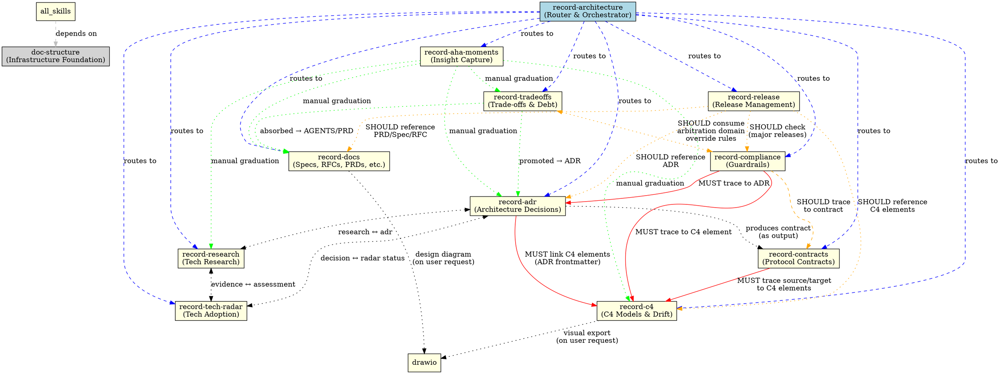

# Doc Structure — Directory Infrastructure & Skill Graph

This skill provides shared infrastructure rules for the `doc/` directory system. It covers directory setup, progressive indexing, agent context loading, naming conventions, and maintains the **authoritative `record-*` skill dependency graph**. All `record-*` skills depend on this for consistent documentation organization.

**OUTPUT LANGUAGE**: All model output to the user MUST be in **Simplified Chinese (简体中文)** unless the surrounding conversation context unambiguously requires English or another language.

---

## Record-* Skill Dependency Graph

This is the **authoritative** inter-skill relationship graph. When any `record-*` skill references another, it MUST follow the edges defined here. This graph is also embedded in `record-architecture/SKILL.md` for routing purposes.

### GraphViz Definition



### Dependency Matrix

| Skill | Depends On (MUST load) | References (SHOULD load) | Feeds Into |
|-------|----------------------|-------------------------|------------|
| `doc-structure` | (none) | — | All skills |
| `record-architecture` | `doc-structure` | All `record-*` skills | (orchestrator only) |
| `record-adr` | `doc-structure`, `record-c4` | `record-research`, `record-tech-radar` | `record-compliance`, `record-aha-moments` |
| `record-c4` | `doc-structure` | `drawio` | `record-adr`, `record-compliance`, `record-contracts` |
| `record-contracts` | `doc-structure`, `record-c4` | `record-adr` | `record-compliance` |
| `record-compliance` | `doc-structure`, `record-adr`, `record-c4` | `record-contracts` | (guardrail only) |
| `record-tech-radar` | `doc-structure` | `record-adr`, `record-research` | `record-adr` |
| `record-research` | `doc-structure` | `record-adr`, `record-tech-radar`, `record-aha-moments` | `record-adr`, `record-tech-radar` |
| `record-docs` | `doc-structure` | `record-c4`, `drawio` | `record-adr`, `record-aha-moments` |
| `record-aha-moments` | `doc-structure` | — | All `record-*` skills (manual graduation) |
| `record-release` | `doc-structure` | `record-docs`, `record-adr`, `record-c4`, `record-compliance` | CHANGELOG |
| `record-tradeoffs` | `doc-structure` | `record-adr`, `record-compliance`, `record-docs` | `record-adr`, `record-compliance`, `record-docs` |

### When to Update This Graph

Update the graph definition and matrix when:
1. A new `record-*` skill is added
2. A new cross-reference dependency is established between existing skills
3. A dependency changes from "advised" to "mandatory" (or vice versa)
4. A skill is removed or renamed

After updating, sync the embedded copy in `record-architecture/SKILL.md`.

---

## Directory Infrastructure

Each `doc/` subdirectory should contain two infrastructure files:

### README.md

**Purpose**: Directory index for human readers, providing navigation and overview.

**Create when**:
- New subdirectory is created under `doc/`
- Directory content grows beyond a few files
- Navigation becomes difficult without an index

**Content**:
- Directory description and scope
- Quick navigation table listing all documents
- Usage instructions (how to create new docs, status changes)
- Link to template file

**Template**: `templates/README__TEMPLATE.md`

### AGENTS.md

**Purpose**: Writing guide for AI agents, ensuring consistent documentation quality.

**Create when**:
- New subdirectory is created under `doc/`
- Directory has specific writing conventions or rules
- Agent needs guidance on when/how to create documents

**Content**:
- When to create documents (triggers and exclusions)
- Core principles (do's and don'ts)
- Template structure reference
- Writing checklist
- Common errors with examples
- File naming conventions

**Template**: `templates/AGENTS__TEMPLATE.md`

### Creation Order

When setting up a new `doc/` subdirectory:

```bash
# 1. Create the directory
mkdir doc/<name>/

# 2. Create README.md from template
cp skills/doc-structure/templates/README__TEMPLATE.md doc/<name>/README.md

# 3. Create AGENTS.md from template
cp skills/doc-structure/templates/AGENTS__TEMPLATE.md doc/<name>/AGENTS.md

# 4. Customize both files for the specific directory's purpose

# 5. Update doc/README.md to include the new directory
```

## Progressive Index Hierarchy

| Level | File | Scope | Size Target |
|-------|------|-------|-------------|
| 0 (Global) | `doc/README.md` or `doc/index.md` | All categories, document counts, drift status | <50 lines |
| 1 (Category) | `doc/<category>/README.md` | Full navigation table for one category | ~100-200 lines |
| 2 (Document) | Individual `.md` files | Single document content | 50-300 lines |

### Index Generation Triggers

| Condition | Action |
|-----------|--------|
| New `doc/` subdirectory created | Create category `README.md` from `templates/README__TEMPLATE.md` |
| Category reaches ≥3 documents | Ensure category `README.md` exists and is up-to-date |
| ≥3 categories have documents | Create or update global index (`doc/README.md`) from `templates/INDEX__TEMPLATE.md` |
| New document added | Update category README document count |
| Document status changes | Update status column in category README and global index |

## Agent Context Loading Strategy

| Scenario | Load Target | Estimated Size |
|----------|-------------|----------------|
| First entry to project | Global index (Level 0) + `key-decisions.md` + `glossary.md` | <100 lines |
| Need quick tech context | `key-decisions.md` only (top-level decisions snapshot) | <30 lines |
| Need term definition | `glossary.md` only | <10 lines per term |
| Need details for one category | Category README (Level 1) | ~100-200 lines |
| Need specific document | Direct file read (Level 2) | 50-300 lines |
| Full history review | Global index + relevant category READMEs | <500 lines |

### Do NOT Load

| Content | Reason |
|---------|--------|
| Empty directories | No information value |
| `_TEMPLATE.md` files | Templates, not actual content |
| Build artifact directories | Not documentation |

## Top-Level Cross-Cutting Documents

Two special documents sit at the `doc/` root level, outside any category directory:

| Document | Path | Purpose | Maintained By |
|----------|------|---------|---------------|
| Key Decisions | `doc/key-decisions.md` | L1.5 横切决策索引 — 从 ADR、tech-radar、compliance 多个来源汇聚项目最关键的技术决策，供 agent 快速建立项目上下文 | `record-adr` |
| Glossary | `doc/glossary.md` | 项目专用术语词典 — 定义领域术语、缩写、技术概念，确保团队和 agent 对核心概念统一理解 | `record-docs` |

These are **NOT** category-level indexes. They are standalone summary documents that aggregate across categories. Agents should read them on first project entry for rapid context building.

## Regression Rules (Before Creating Any Document)

```
RULE 1: Check global index exists
  → If yes, read it for document counts and categories
  → If no, create it from templates/INDEX__TEMPLATE.md

RULE 2: Check category README exists
  → If yes, check numbering continuity and similar topics
  → If no, create it from templates/README__TEMPLATE.md

RULE 3: Check for duplicates
  → Run: python3 skills/doc-structure/scripts/scan_docs.py check-duplicates --dir doc/
  → If overlap found → UPDATE existing document, do NOT create duplicate

RULE 4: Assign next number (if numbered type)
  → Run: python3 skills/doc-structure/scripts/scan_docs.py list --dir doc/<category>/ --json
  → Parse existing filenames, find highest existing number, increment by 1
```

## Naming Conventions — Master Table

| Document Type | Pattern | Example | Skill |
|---------------|---------|---------|-------|
| ADR | `[domain/]NNN-kebab-title.md` | `001-doris-partition-strategy.md` | `record-adr` |
| ADR (with domain) | `<domain>/NNN-kebab-title.md` | `storage-partition/001-table-override.md` | `record-adr` |
| C4 | `[level-]kebab-name.md` | `system-ecommerce-platform.md` | `record-c4` |
| Contracts | `YYYYMMDD[-NN]__kebab-name.md` | `20260616__agent-eventhandler-acp-mapping.md` | `record-contracts` |
| Compliance Rules | `<category>-kebab-rule.md` | `naming-convention-api-endpoints.md` | `record-compliance` |
| Tech Radar | `kebab-tech-name.md` | `apache-kafka.md` | `record-tech-radar` |
| Research | `[domain/]YYYYMMDD[-NN]-kebab-title.md` | `20260601-flink-cdc-duplicate-key-verify.md` | `record-research` |
| Research (intra-day, 2+ reports) | `[domain/]YYYYMMDD-NN-kebab-title.md` | `20260601-02-clickhouse-vs-doris.md` | `record-research` |
| Retrospectives | `YYYYMMDD-kebab-title.md` | `20260518-sprint-3-retro.md` | `record-docs` |
| Meeting Notes | `YYYYMMDD-topic.md` | `20260518-cdc-pipeline-review.md` | `record-docs` |
| Agent Sessions | `YYYYMMDD-kebab-title.md` | `20260518-flink-cdc-wildcard-verify.md` | `record-docs` |
| Specs | `module-name.md` | `payment-service.md` | `record-docs` |
| RFCs | `NNN-kebab-title.md` | `001-migrate-to-grpc.md` | `record-docs` |
| PRD | `feature-name.md` | `user-dashboard.md` | `record-docs` |
| Aha Moments | `YYYYMMDD-kebab-title.md` | `20250401-prompt-caching-insight.md` | `record-aha-moments` |
| Trade-offs | `YYYYMMDD__<short-slug>.md` | `20260717__synchronized-fallback.md` | `record-tradeoffs` |
| Releases | `YYYYMMDD__vX.Y.Z-{SNAPSHOT\|RC\|GA}__short-name.md` | `20260623__v0.1.0-RC__multi-tenant.md` | `record-release` |
| CHANGELOG | `CHANGELOG.md` (固定文件名) | `CHANGELOG.md` | `record-release` |
| Key Decisions | `key-decisions.md` (固定文件名) | `key-decisions.md` | `record-adr` |
| Glossary | `glossary.md` (固定文件名) | `glossary.md` | `record-docs` |

## Unified YAML Frontmatter Specification

**STATUS**: Authoritative specification. All `record-*` skills MUST conform to this standard for document templates. Any deviation requires updating this spec first.

### Rationale

Currently 5 of 7 `record-*` skills use markdown bullets (`- **Field**: value`) instead of YAML frontmatter for document metadata. This prevents:
- Programmatic querying of document status
- Consistent smart loading (triage by status before reading full files)
- Cross-skill tooling (e.g., "show all in-review documents across ADR, research, and RFCs")

YAML frontmatter (delimited by `---`) is the standard for machine-readable metadata in Markdown documents.

### Common Fields — ALL record-* Templates

Every record-* document template MUST include these fields in its YAML frontmatter:

```yaml
---
status: draft              # See unified status model below
created: YYYY-MM-DD
updated: YYYY-MM-DD
author: ""
tags: []
related:                   # At least one reference required
  adr: ""                  # e.g., "ADR-023"
  c4: ""                   # e.g., "system-ecommerce-platform"
  research: ""             # e.g., "20260601-clickhouse-vs-doris.md"
  radar: ""                # e.g., "apache-kafka.md"
---
```

**Field rules**:
- `status`: Always present. Value MUST be one of the unified status values (see below).
- `created` / `updated`: Always present. `updated` MUST be bumped on every edit.
- `author`: Always present. The person or agent who created the document.
- `tags`: Always present as an array. Minimum: skill-specific tag (e.g., `["adr"]`).
- `related`: Always present. At least one of `adr`, `c4`, `research`, `radar` MUST be filled. Set unused sub-fields to `""` (empty string, not absent).

### Unified Status Lifecycle Model

All record-* documents share a common base lifecycle. Type-specific states extend or alias the base states.

**Base lifecycle (applies to ALL types)**:

```
draft → in-progress → in-review → complete
  ↓         ↓             ↓           ↓
cancelled cancelled     draft     superseded
                                     ↓
                                  archived
```

**Base state definitions**:

| State | Meaning | Applies To |
|-------|---------|------------|
| `draft` | Content being authored, not yet ready for review | All types |
| `in-progress` | Active work in progress | Research, C4 |
| `in-review` | Awaiting human review/approval | All types |
| `complete` | Finalized and accepted | All types |
| `superseded` | Replaced by a newer document | ADR, Research, RFC |
| `archived` | No longer relevant | All types |
| `cancelled` | Work abandoned before completion | All types |

**Type-specific status aliases** (use these values in the `status` field, not the base names):

| Skill | `status` Values | Maps To (Base) |
|-------|----------------|-----------------|
| `record-adr` | `draft`, `proposed`, `accepted`, `implemented`, `superseded`, `deprecated` | `proposed` = `in-review`; `accepted` = `in-progress`; `implemented` = `complete`; `deprecated` = `archived` |
| `record-c4` | `draft`, `confirmed`, `updated` | `confirmed` = `complete`; `updated` = `complete` (with bumped date) |
| `record-compliance` | `draft`, `active`, `deprecated` | `active` = `complete`; `deprecated` = `archived` |
| `record-tech-radar` | `draft`, `in-review`, `complete` | Plus `tech_status` separate field for `adopt/trial/assess/hold` |
| `record-research` | `draft`, `in-progress`, `in-review`, `complete`, `superseded`, `archived`, `cancelled` | Full base model |
| `record-docs/RFC` | `draft`, `in-review`, `approved`, `implemented`, `deprecated` | `approved` = `complete`; `deprecated` = `archived` |
| `record-docs/SPEC`, `record-docs/PRD` | `draft`, `in-review`, `approved` | `approved` = `complete` |
| `record-docs` (other) | `draft`, `complete` | Simplified — meeting notes, retrospectives don't need full lifecycle |
| `record-aha-moments` | `seedling`, `graduated` | Lightweight by design |
| `record-release` | `draft`, `proposed`, `in-progress`, `in-review`, `released`, `superseded`, `cancelled`, `archived` | `proposed` = `in-review`; `in-progress` = `in-progress`; `released` = `complete` |

> **Note: The base lifecycle arrow order (`draft → in-progress → in-review → complete`) represents a default typical flow, not a strict linear constraint on all document types.** Each type maps to base states according to its own domain semantics; the actual traversal order may differ from the base diagram. For example, ADR flows as `draft → proposed(=in-review) → accepted(=in-progress) → implemented(=complete)` — "review first, then execute" — which is the reverse of the base diagram's "execute first, then review." This is by design: base states are valuable for cross-type aggregation (querying), not for sequencing (forcing all types through the same order).

### Type-Specific Fields — Per Skill

Fields beyond the common set. Only include if the skill's template needs them.

```yaml
# === record-adr ===
decider: ""               # Person/team who made the decision
affected_c4_elements: []  # List of C4 element names

# === record-c4 ===
c4_type: ""               # System Context / Container / Component
parent: ""                # Parent element name (Container → System; Component → Container)

# === record-compliance ===
rule_type: ""             # One of 7 types (naming, dependency, layer, api, security, data, testing)
severity: ""              # Blocker / Critical / Warning / Info

# === record-tech-radar ===
tech_status: ""           # Adopt / Trial / Assess / Hold (separate from document status!)
tech_category: ""         # Language / Framework / Database / Tool / Platform / Library

# === record-research ===
domain: ""                # web-search / code-verify
hypotheses: []            # Array of { id, claim, result }
library:                  # Third-party lib research only (optional)
  name: ""
  latest_version: ""
  license: ""

# === record-docs/RFC ===
rfc_number: NNN           # Sequential RFC number

# === record-docs/SPEC, record-docs/PRD ===
version: ""               # Semver string

# === record-release ===
version: ""                # Semantic version, e.g., "0.1.0"
target_date: ""            # Planned release date (YYYY-MM-DD)
supersedes: ""             # Path to previous lifecycle file for same version
```

### Smart Loading Standard

All record-* skills MUST implement a triage-first loading strategy to prevent context window bloat. Replace any pattern that loads all files:

**FORBIDDEN** (anti-pattern):
```bash
for f in doc/<category>/*.md; do read "$f"; done
```

**REQUIRED** (triage-first):
```
STEP L.1: Read doc/<category>/README.md first (category index)
STEP L.2: Run triage scan to identify active + recent complete documents:
          python3 skills/doc-structure/scripts/scan_docs.py triage --dir doc/<category>/
          默认返回: 所有 in-progress / in-review / proposed / accepted + 最近 3 篇 complete
          --recent N 可调整最近完成文档数量
STEP L.3: Load ONLY the documents listed in triage output
STEP L.4: Skip: archived, superseded, cancelled, stale draft documents
STEP L.5: If > 10 documents in category → 添加 --recent 5 限制
```

**Skills affected**: `record-compliance` and `record-tech-radar` currently use the forbidden pattern. `record-adr`, `record-c4`, and `record-docs` have no loading strategy defined.

### Migration Guide: Markdown Bullets → YAML Frontmatter

When upgrading a skill from markdown bullet metadata to YAML frontmatter:

```
BEFORE (markdown bullets):
# Title
- **Status**: Draft
- **Date**: 2026-06-01
- **Author**: tianyi

AFTER (YAML frontmatter):
---
status: draft
created: 2026-06-01
updated: 2026-06-01
author: tianyi
tags: ["adr"]
related:
  adr: ""
  c4: "system-ecommerce-platform"
  research: ""
  radar: ""
---
# Title
```

**Rules**:
1. YAML frontmatter MUST be the first content in the file, delimited by `---`
2. Field names use `snake_case` (not Title Case as in markdown bullets)
3. Dates use `YYYY-MM-DD` format
4. `tags` is always a YAML array, even for single values
5. `related` sub-fields set to `""` when not applicable (never omit the sub-field)
6. Remove the old markdown bullet metadata lines after migration

---

## Scripts

### `scripts/scan_docs.py`

扫描 `doc/` 目录下所有 Markdown 文档的 YAML frontmatter，支持状态过滤、分类统计、重复检测和字段验证。

**用法**:

```bash
# 列出所有文档及其状态
python3 skills/doc-structure/scripts/scan_docs.py list --dir doc/adr/

# 仅显示活跃文档（draft / in-progress / in-review）
python3 skills/doc-structure/scripts/scan_docs.py active --dir doc/ --recursive

# Triage-first 加载策略（活跃 + 最近 3 篇 complete）
python3 skills/doc-structure/scripts/scan_docs.py triage --dir doc/research/

# 按分类统计
python3 skills/doc-structure/scripts/scan_docs.py summary --dir doc/

# 检查重复文档
python3 skills/doc-structure/scripts/scan_docs.py check-duplicates --dir doc/

# 验证 frontmatter 必填字段
python3 skills/doc-structure/scripts/scan_docs.py validate --dir doc/adr/

# JSON 输出（便于程序化消费）
python3 skills/doc-structure/scripts/scan_docs.py list --dir doc/research/ --json
```

**子命令一览**:

| 命令 | 用途 | 关键参数 |
|------|------|----------|
| `list` | 列出所有文档及状态、创建/更新日期、作者 | `--dir`, `--recursive`, `--json` |
| `active` | 仅显示活跃文档（排除 complete/implemented/archived/superseded） | `--dir`, `--recursive`, `--json` |
| `triage` | Triage-first 加载列表：活跃 + 最近 N 篇完成 | `--dir`, `--recursive`, `--recent N` |
| `summary` | 按分类统计（总数/活跃/完成/非活跃） | `--dir`（应为 doc/ 根目录） |
| `check-duplicates` | 检测文件名相似度和标题重复 | `--dir`（应为 doc/ 根目录） |
| `validate` | 验证所有文档的 frontmatter 必填字段 | `--dir`, `--recursive` |

**设计原则**:

- 状态来源为 frontmatter 的 `status` 字段，不再依赖手动维护的 README 索引表
- 活跃状态集: `draft`, `in-progress`, `in-review`, `proposed`, `accepted`（含类型别名）
- 完成状态集: `complete`, `implemented`, `approved`, `confirmed`（各类型别名自动识别）
- 排除文件: `README.md`, `AGENTS.md`, `GLOSSARY.md`, `INDEX.md`
- `--recursive` 用于跨分类扫描；不加则仅扫描当前层级

---

## Templates

```
skills/doc-structure/
├── SKILL.md                     # This file
├── scripts/
│   └── scan_docs.py             # YAML frontmatter 扫描与状态查询
└── templates/
    ├── README__TEMPLATE.md      # Directory index template
    ├── AGENTS__TEMPLATE.md      # Agent writing guide template
    └── INDEX__TEMPLATE.md       # Global progressive index template
```
