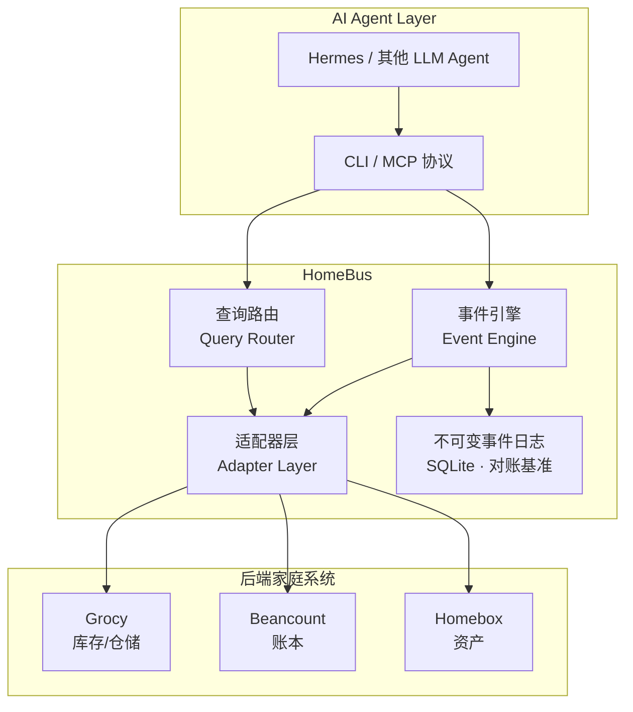

# HomeBus — 家庭服务总线

> **Why · What · When · How** — 面向 AI Agent 与开发者的一站式家庭数据协调器。

---

## WHY — 为什么需要 HomeBus？

家里有三套系统独立运转：

| 系统 | 管什么 | 问题 |
|------|--------|------|
| **Beancount** | 账本（花了多少钱，买了什么） | 纯手动记账，无法感知实物变动 |
| **Grocy** | 仓储（冰箱里有什么，快过期了） | 库存变动不反映到账本 |
| **Homebox** | 资产（家里有什么东西，放哪了） | 购入/报废不通知仓储和账本 |

一个典型场景就能暴露问题：**"在京东买了箱牛奶"**

- Beancount 记了支出 → ✅
- Grocy 不知道进了库存 → ❌ 直到手动录入
- Homebox 不知道新增了资产 → ❌ 没人记得录入

**HomeBus 的答案是**：任何家庭数据变更只描述一次，HomeBus 负责分发给所有后端系统，并确保它们最终一致。

---

## WHAT — HomeBus 是什么？

HomeBus 是一个**家庭服务总线（Family Service Bus）**，作为 Beancount、Grocy、Homebox 之间的单一写入和查询入口。

### 核心能力



| 能力 | 说明 |
|------|------|
| **CQRS 分离** | 写路径（事件日志+执行记录）与读路径（查询代理）分离 |
| **不可变事件日志** | 所有写入先追加日志，作为对账基准，绝不修改/删除 |
| **Saga 补偿** | 部分失败时自动生成逆向事件回滚 |
| **幂等重试** | 通过 `event_id` 去重，安全重试 |
| **调谐引擎** (v0.3) | 定期对比期望状态与实际状态，自动修复差异 |

---

## WHEN — 什么时候用它？

- ✅ **AI Agent 操作家庭数据** — 通过 CLI / MCP 完成跨系统的单次操作
- ✅ **自动对账** — 发现 Grocy 库存与 Beancount 采购记录不符时自动修正
- ✅ **手动录入** — 通过 CLI 快速录入"买了XX"并自动分发到后端

### 版本路线


---

## HOW — 怎么用？

### 快速开始

```bash
# 1. 安装 CLI
pipx install homebus-cli

# 2. 配置后端地址
mkdir -p ~/.config/homebus
cat > ~/.config/homebus/config.toml << 'EOF'
[adapters.grocy]
base_url = "http://192.168.31.40:9283"

[adapters.homebox]
base_url = "http://192.168.31.40:7745"
EOF

# 3. 注入敏感信息
export GROCY_API_KEY=your-key
export HOMEBOX_TOKEN=your-token

# 4. 开始使用
homebus create grocy/stock/add --body '{"product_id": "1", "amount": 2}'
homebus exec <event-id>
homebus query grocy/stock --filter '{"product_id": "1"}'
```

### Agent（Hermes）集成

Agent 通过终端工具调用 `homebus` CLI：

```python
# Hermes skill 示例
def buy_milk():
    """Agent 自动完成：记账 + 入库"""
    event_id = terminal("homebus create grocy/stock/add --body '{\"product_id\":\"1\",\"amount\":2}'")
    result = terminal(f"homebus exec {event_id}")
```

v0.2 将提供 MCP Server，Agent 可直接通过 MCP tools 调用 HomeBus，无需拼装 CLI 命令。

---

## 技术栈

| 组件 | 技术 |
|------|------|
| 运行环境 | Python 3.11+ |
| API Server | FastAPI + Uvicorn |
| 持久化 | SQLite (aiosqlite) |
| 配置 | TOML (`tomllib` 标准库) |
| CLI | Click |
| 模型层 | Pydantic |

## 文档索引

| 文档 | 说明 |
|------|------|
| [架构规格](doc/specs/homebus.md) | 完整技术规格、数据模型、API 设计 |
| [配置范式](doc/specs/config-paradigm.md) | 配置加载分层、目录规范、环境变量映射 |
| [术语表](doc/glossary.md) | 项目专用术语定义 |
| [C4 模型](doc/c4/) | 6 份架构视图（上下文/容器/组件） |
| [MVP PRD](doc/prd/homebus-v0.1.md) | v0.1 产品需求文档 |
| [RFC-001](doc/rfcs/rfc-001-config-format-change.md) | 配置格式从 YAML 变更为 TOML |
| [RFC-002](doc/rfcs/rfc-002-pypi-publishing.md) | CLI 通过 PyPI 发布 |
| [路线图](ROADMAP.md) | v0.1 → v1.0 规划 |
| [AGENTS.md](AGENTS.md) | AI Agent 工作指南（架构规则） |
