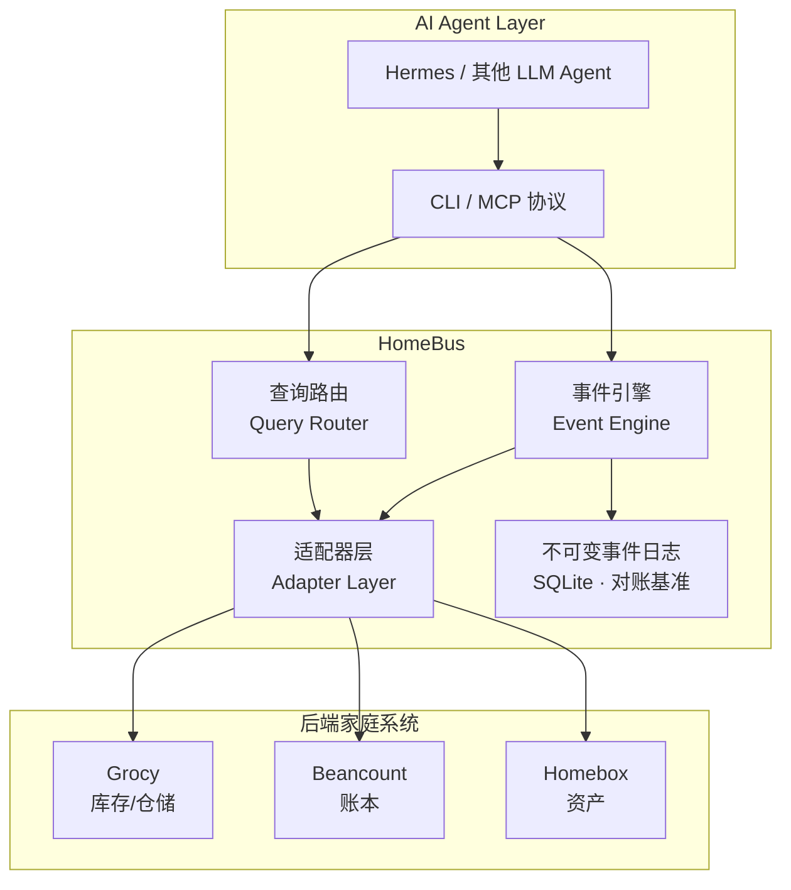
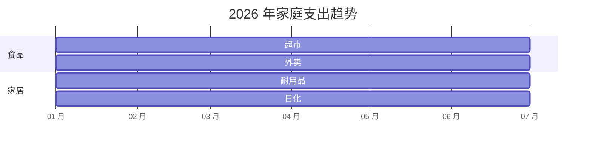
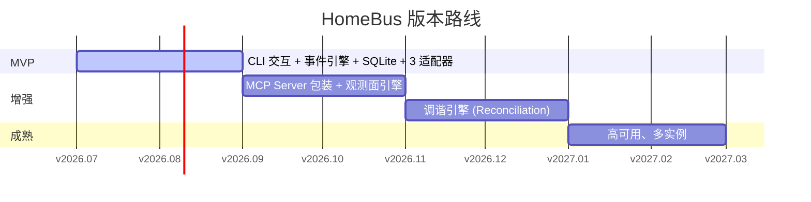

# HomeBus — 家庭服务总线

> **Why · What · When · How** — 面向 AI Agent 与开发者的一站式家庭数据协调器。

---

## WHY — 为什么需要 HomeBus？

家里有三套系统独立运转：

| 系统 | 管什么 | 问题 |
|------|--------|------|
| **Beancount** | 账本（花了多少钱，买了什么） | 纯手动记账，无法感知实物变动 |
| **Grocy** | 仓储（冰箱里有什么，快过期了） | 库存变动不反映到账本 |
| **Homebox** | 资产（家里有什么东西，放哪了） | 购入/报废不通知仓储和账本 |

一个典型场景就能暴露问题：**"在京东买了箱牛奶"**

- Beancount 记了支出 → ✅
- Grocy 不知道进了库存 → ❌ 直到手动录入
- Homebox 不知道新增了资产 → ❌ 没人记得录入

**HomeBus 的答案是**：任何家庭数据变更只描述一次，HomeBus 负责分发给所有后端系统，并确保它们最终一致。

---

## WHAT — HomeBus 是什么？

HomeBus 是一个**家庭服务总线（Family Service Bus）**，作为 Beancount、Grocy、Homebox 之间的单一写入和查询入口。

### 核心能力



| 能力 | 说明 |
|------|------|
| **CQRS 分离** | 写路径（事件日志+执行记录）与读路径（查询代理）分离 |
| **不可变事件日志** | 所有写入先追加日志，作为对账基准，绝不修改/删除 |
| **Saga 补偿** | 部分失败时自动生成逆向事件回滚 |
| **幂等重试** | 通过 `event_id` 去重，安全重试 |
| **调谐引擎** (v0.3) | 定期对比期望状态与实际状态，自动修复差异 |

---

## VALUE — 你能获得什么？

> HomeBus 不是一个"多了个东西要维护"的系统——它是让 Beancount、Grocy、Homebox 从三套孤立工具变成一个**可观测、可分析、可指导行动的家庭运营仪表盘**的关键拼图。

### 1. 消除反复录入，省下的是真实时间

之前：
```
京东买牛奶 → Beancount 记账 → 打开 Grocy 手动入库 → 如果是新家电再打开 Homebox 录入资产
8 分钟 vs 1 次描述
```

之后：
```
"买了牛奶，放到冰箱上层" ──[一句话]──→ HomeBus 自动分发到三个系统
```

以三口之家每月 30-50 次物品变动计算，每月节省 2-4 小时，且**零遗漏**。

### 2. 观测面：跨系统统计报表

HomeBus v0.2 引入**观测面引擎**，聚合三个后端数据生成家庭运营报表。以下是可用报表清单及对实际生活的指导意义。

#### 📊 库存-支出交叉报表

| 品类 | 本月库存消耗 | 本月采购支出 | 上月支出 | 环比 | 健康提示 |
|------|------------|------------|---------|------|---------|
| 乳制品 | 3.5 kg | ¥162.40 | ¥89.50 | ↑ 81% | 消耗量翻倍，检查是否有浪费 |
| 调味品 | 0.8 L | ¥45.00 | ¥52.30 | ↓ 14% | 消耗稳定，无需囤货 |
| 冷冻肉 | 2.1 kg | ¥187.60 | ¥210.00 | ↓ 11% | 库存充足，本周不必再买 |
| 个人护理 | 0 L | ¥0.00 | ¥35.90 | ↓ 100% | 库存还有余量，但牙膏下周可能见底 |

**👆 能回答的问题：**
- "冰箱里的东西真的被吃掉了，还是买回来就浪费了？"
- "这个月买菜花的钱和上个月比是多了还是少了？"
- "消耗和采购不匹配——是不是又在打折时囤了不需要的东西？"

#### 📦 库存-资产关联报表

| 分类 | 仓储库存（Grocy） | 资产总量（Homebox） | 匹配度 | 说明 |
|------|-----------------|-------------------|--------|------|
| 厨房电器 | 0 | 7 件 | ⚠️ 仅资产 | 有空气炸锅，但耗材（锡纸盘）没设库存提醒 |
| 清洁用品 | 4 类 | 2 件 | ✅ 匹配 | 拖把有资产记录，清洁剂有库存，自动补货周期合理 |
| 应急工具 | 0 | 3 件 | ⚠️ 仅资产 | 有灭火器但没挂"下次检查日期"提醒 |

**👆 能回答的问题：**
- "哪些东西买了就忘了放在哪？"
- "耗材用完了但资产还在——该补货了，提醒我。"
- "搬家时哪些东西扔了、哪些卖了？可查 Homebox 报废日志 + Beancount 二手收入对账。"

#### 💰 支出趋势报表



| 月份 | 食品支出 | 环比 | 日化支出 | 环比 | 耐用品支出 | 备注 |
|------|---------|------|---------|------|----------|------|
| 1 月 | ¥1,820 | — | ¥240 | — | ¥350 | 春节囤货 |
| 2 月 | ¥1,560 | ↓ 14% | ¥180 | ↓ 25% | ¥0 | 正常 |
| 3 月 | ¥1,710 | ↑ 10% | ¥220 | ↑ 22% | ¥1,200 | 买了新洗衣机 |
| 4 月 | ¥1,480 | ↓ 13% | ¥160 | ↓ 27% | ¥80 | 回稳 |
| 5 月 | ¥1,930 | ↑ 30% | ¥190 | ↑ 19% | ¥0 | 支出异常——排查发现是**囤了两箱进口果汁没喝完** |

**👆 能回答的问题：**
- "这个月哪项支出异常偏高？"
- "上个月买的洗衣机，对应的洗涤剂也在 Grocy 入库了吗？"
- "哪些消费是重复性的（每月都有），哪些是偶发的（几个月一次）？"

#### 🏠 位置-库存分布热力图

| 位置 | 物品数 | 库存总价值 | 过期风险物品 | 上次盘点 |
|------|-------|-----------|------------|---------|
| 厨房 - 冰箱 | 24 件 | ¥370 | 3 件（3 天内到期） | 7 天前 |
| 厨房 - 储物柜 | 18 件 | ¥210 | 0 件 | 14 天前 |
| 卫生间 - 浴室柜 | 12 件 | ¥160 | 1 件（洗发水快用完） | 30 天前 |
| 书房 - 工具抽屉 | 8 件 | ¥480 | 0 件 | 90 天前 |

**👆 能回答的问题：**
- "冰箱里有啥快过期了？今晚吃掉还是扔掉？"
- "想找充电宝，Homebox 显示在客厅储物格——去看一眼。"
- "卫生间的东西超过一个月没看过了，周末检查一下。"

### 3. 对实际生活的指导作用

#### 以一周为周期

| 时间 | 我应该做什么 | HomeBus 提供什么 |
|------|------------|----------------|
| 周日晚上 | 规划下周采购清单 | 📋 "根据消耗趋势，下周需购买：牛奶×2、鸡蛋×1、牙膏×1 |
| 每次购物后 | 录入买了什么 | ✅ 一句话描述即可，Agent 负责分发 |
| 看到打折 | 判断是否真的需要买 | 📊 "当前库存够吃 5 天，距离过期还有 4 天。囤 2 箱可能吃不完。" |

#### 以季度为周期

| 关注点 | 示例洞察 |
|--------|---------|
| **减少浪费** | "你本季度扔掉了 ¥230 的过期食品。主要品类：乳制品。建议减少单次购买量，每周买 2 次。" |
| **优化采购渠道** | "日化用品在京东比楼下超市贵 15%。但京东满减后实际只贵 3%。不如每月一次京东集中采购省时间。" |
| **资产使用寿命** | "你 3 年前买的吸尘器，按使用频率（每周 2 次）预计剩余寿命 8 个月。提前研究下一代型号。" |
| **库存周转率** | "干货类库存平均积压 4.2 个月才消耗完。建议不囤干货，用时再买。" |

#### 以年为周期

| 场景 | HomeBus 帮助 |
|------|------------|
| **年度家庭预算** | 导出全年支出报表，按品类（食品/日化/耐用品）分析占比，设定明年预算红线 |
| **家庭资产盘点** | Homebox 的完整资产列表 + 购入价格（Beancount）→ 家庭资产负债表 |
| **保险规划** | "你的家电总价值 ¥48,000（3 台空调 + 洗衣机 + 冰箱），是否考虑家庭财产险？" |
| **生活习惯反思** | "全年外卖支出 ¥12,400，占食品总支出的 38%。如果每周少点 1 次外卖，一年省 ¥2,600。" |

---

## WHEN — 什么时候用它？

- ✅ **AI Agent 操作家庭数据** — 通过 CLI / MCP 完成跨系统的单次操作
- ✅ **自动对账** — 发现 Grocy 库存与 Beancount 采购记录不符时自动修正
- ✅ **手动录入** — 通过 CLI 快速录入"买了XX"并自动分发到后端

### 版本路线



---

## HOW — 怎么用？

### 快速开始

```bash
# 1. 安装 CLI
pipx install homebus-cli

# 2. 配置后端地址
mkdir -p ~/.config/homebus
cat > ~/.config/homebus/config.toml << 'EOF'
[adapters.grocy]
base_url = "http://localhost:9283"

[adapters.homebox]
base_url = "http://localhost:7745"
EOF

# 3. 注入敏感信息
export GROCY_API_KEY=your-key
export HOMEBOX_TOKEN=your-token

# 4. 开始使用
homebus create grocy/stock/add --body '{"product_id": "1", "amount": 2}'
homebus exec <event-id>
homebus query grocy/stock --filter '{"product_id": "1"}'
```

### Agent（Hermes）集成

Agent 通过终端工具调用 `homebus` CLI：

```python
# Hermes skill 示例
def buy_milk():
    """Agent 自动完成：记账 + 入库"""
    event_id = terminal("homebus create grocy/stock/add --body '{\"product_id\":\"1\",\"amount\":2}'")
    result = terminal(f"homebus exec {event_id}")
```

v0.2 将提供 MCP Server，Agent 可直接通过 MCP tools 调用 HomeBus，无需拼装 CLI 命令。

---

## 技术栈

| 组件 | 技术 |
|------|------|
| 运行环境 | Python 3.11+ |
| API Server | FastAPI + Uvicorn |
| 持久化 | SQLite (aiosqlite) |
| 配置 | TOML (`tomllib` 标准库) |
| CLI | Click |
| 模型层 | Pydantic |

## 文档索引

| 文档 | 说明 |
|------|------|
| [架构规格](doc/specs/homebus.md) | 完整技术规格、数据模型、API 设计 |
| [配置范式](doc/specs/config-paradigm.md) | 配置加载分层、目录规范、环境变量映射 |
| [术语表](doc/glossary.md) | 项目专用术语定义 |
| [C4 模型](doc/c4/) | 6 份架构视图（上下文/容器/组件） |
| [MVP PRD](doc/prd/homebus-v0.1.md) | v0.1 产品需求文档 |
| [RFC-001](doc/rfcs/rfc-001-config-format-change.md) | 配置格式从 YAML 变更为 TOML |
| [RFC-002](doc/rfcs/rfc-002-pypi-publishing.md) | CLI 通过 PyPI 发布 |
| [路线图](ROADMAP.md) | v0.1 → v1.0 规划 |
| [AGENTS.md](AGENTS.md) | AI Agent 工作指南（架构规则） |
