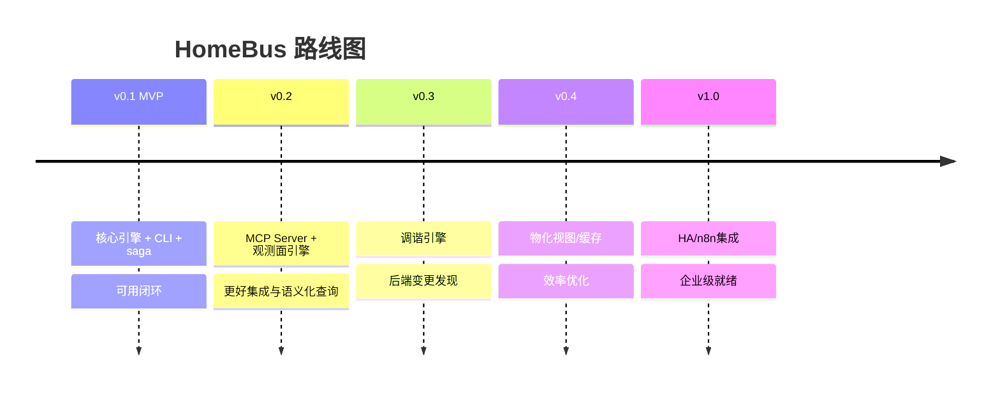

# HomeBus Roadmap

> 本文档是 HomeBus 项目的整体路线图，按版本阶段组织。
> 每个版本对应一个独立的 PRD 文档，详情见各阶段 PRD。

## 阶段总览



| 版本 | 主题 | 核心交付 | 预计交付 |
|------|------|---------|---------|
| **v0.1 MVP** | 最小可用闭环 | API + CLI + 3 后端适配器 + Saga 补偿 + 查询代理 | 2-3 周 |
| **v0.2** | Agent 体验升级与观测面 | MCP Server + Webhook + 观测面引擎 | v0.1 后 1-2 周 |
| **v0.3** | 数据一致性 | 调谐引擎 (Reconciliation) | v0.2 后 2-3 周 |
| **v0.4** | 效率与扩展性 | 查询物化视图 / 缓存 / 降级模式 | v0.3 后 2-3 周 |
| **v1.0** | 生产就绪 | HA 高可用 / n8n 集成 / 多用户权限 | TBD |

---

## v0.1 — MVP（最小可行产品）

**主题**：可用闭环

**目标**：Agent 可以通过 CLI 完成"买牛奶"这样的完整流程 → HomeBus 写入事件 → 调度 Grocy + Beancount → Saga 兜底 → Agent 轮询确认。

**核心交付清单：**

- [x] C4 模型（L1-L3 文字描述）
- [x] PRD（本文档前身的 PRD）
- [ ] HomeBus API Server（FastAPI）
- [ ] SQLite 数据库（events 表 + executions 表）
- [ ] POST /v1/events（幂等写入）
- [ ] GET /v1/events/{event_id}（状态查询）
- [ ] POST /v1/query（查询代理）
- [ ] GET /v1/health（健康检查）
- [ ] 事件校验器（Schema + 幂等）
- [ ] 调度引擎（子任务推导 + 分发）
- [ ] 任务执行器（并发/串行 + 超时 + 重试）
- [ ] Saga 补偿器（失败回滚）
- [ ] 结果聚合器（终态推导）
- [ ] Grocy Adapter
- [ ] Beancount Adapter
- [ ] Homebox Adapter
- [ ] 路由注册表（TOML 加载 + 缓存，供 Dispatch Engine 查路由规则）
- [ ] 查询路由
- [ ] HomeBus CLI（publish / query / status / health / init）
- [ ] 端到端集成测试
- [ ] Docker Compose 部署

**PRD**: [doc/prd/homebus-v0.1.md](doc/prd/homebus-v0.1.md)

---

## v0.2 — Agent 体验升级与观测面

**主题**：更好的集成方式 + 语义化查询

**核心交付：**

| 功能 | 说明 | 依赖 |
|------|------|------|
| HomeBus MCP Server | MCP 协议封装，Agent 通过 MCP Client 直接调用 HomeBus | v0.1 API |
| Webhook 回调 | 事件完成时主动通知 Agent（代替轮询） | v0.1 API |
| 观测面引擎 | 跨系统聚合查询——Agent 按语义名称（零食/厨房/家电）查库存+支出+资产 | v0.1 Routing Registry + Adapter |
| 查询结果格式化 | 结构化输出更友好（表格/摘要） | — |
| CLI 体验优化 | 支持 JSON 文件参数、彩色输出、进度条 | v0.1 CLI |

**不做的：**
- ❌ 调谐引擎
- ❌ 物化视图

---

## v0.3 — 数据一致性

**主题**：自动发现后端差异

**核心交付：**

| 功能 | 说明 | 依赖 |
|------|------|------|
| 调谐引擎核心 | 定期比对 HomeBus 事件日志与后端实际状态 | v0.1 API |
| Grocy 调谐适配器 | 检查 Grocy 库存与 events 记录是否一致 | v0.1 Grocy Adapter |
| Beancount 调谐适配器 | 检查 Beancount 账目与 events 记录是否一致 | v0.1 Beancount Adapter |
| Homebox 调谐适配器 | 检查 Homebox 资产与 events 记录是否一致 | v0.1 Homebox Adapter |
| 差异自动补偿 | 自动写入 compensation event 修复差异 | v0.1 Saga |
| 调谐报告 | 输出调谐结果的汇总报告 | — |

**不做的：**
- ❌ 实时 Webhook 监听
- ❌ CQRS 物化视图

---

## v0.4 — 效率与扩展性

**主题**：查得快、支持降级

**核心交付：**

| 功能 | 说明 | 依赖 |
|------|------|------|
| 查询物化视图 | 定期同步后端数据到本地 SQLite，查询不穿透后端 | v0.1 query + v0.3 调谐 |
| 本地缓存 | 热点查询（如库存余量）缓存 30s-60s | — |
| 降级模式 | 后端不可用时返回过期缓存或友好错误 | v0.1 health |
| 后台任务调度 | 内建 cron 替代外部 cron | v0.3 调谐 |

---

## v1.0 — 生产就绪

**主题**：稳定可靠，生态集成

**核心交付（待定）：**

| 功能 | 说明 |
|------|------|
| HA 高可用 | 多实例部署 + SQLite 迁移到 PostgreSQL |
| 多用户/权限 | 家庭成员独立视角 |
| n8n 集成 | Workflow 自动化触发 HomeBus 事件 |
| APM 集成 | OpenTelemetry 链路追踪 |
| Admin Dashboard | Web 管理界面 |
| 事件重放 | 基于 events 表重新执行指定事件 |

---

## 决策记录

| 日期 | 决策 | 理由 |
|------|------|------|
| 2026-07-20 | CLI 先行，MCP 后加（v0.2） | 开发成本低，快速验证闭环 |
| 2026-07-20 | 调谐引擎 v0.3 再做 | MVP 聚焦主体流程可用性 |
| 2026-07-20 | 查询走总线（MVP 包含） | 保持单一入口原则完整 |

---

## 附录：版本依赖图

```
v0.1 ─────────────────────────────────────────
  │                                              │
  ├→ v0.2 (MCP + Webhook + 观测面引擎, 层叠在 v0.1 API 之上)
  │                                                 │
  ├→ v0.3 (调谐, 依赖 v0.1 events 日志和 Adapters)  │
  │     │                                           │
  │     └→ v0.4 (物化视图, 依赖 v0.3 的数据同步)     │
  │                                                 │
  └──────────────────────→ v1.0 (HA 等, 在 v0.4 之后)
```

v0.1 是地基。v0.2 和 v0.3 **不互斥但也不并行**——它们各自依赖 v0.1 的不同能力（v0.2 依赖查询/注册表层，v0.3 依赖事件日志/Adapters），开发顺序可以交错。v0.4 依赖 v0.3；v1.0 依赖所有前面阶段。
