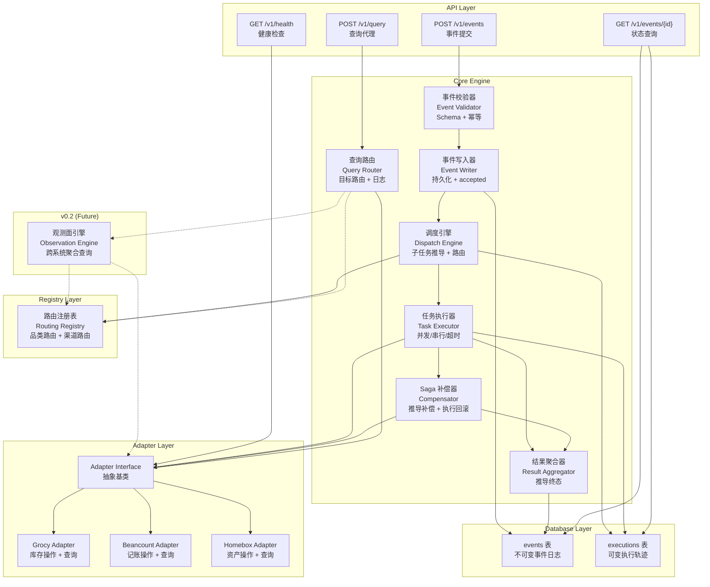
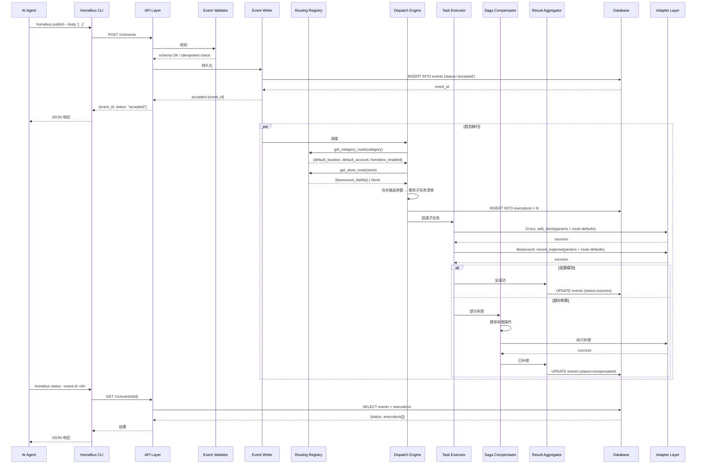
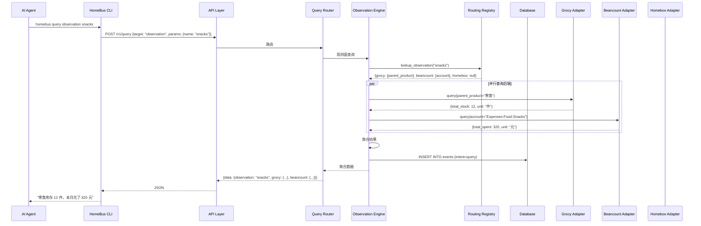

# C4 Level 3: Components — HomeBus API Server 核心引擎

> HomeBus API Server 的内部组件分解。这是整个系统的核心。

## 组件结构图



## 组件列表

### 1. API Layer

| 组件 | 职责 | 输入 | 输出 |
|------|------|------|------|
| POST `/v1/events` | 事件提交入口 | `{intent, items, total_price, ...}` | `{event_id, status, message}` |
| GET `/v1/events/{id}` | 事件状态查询 | `event_id` | `{event_id, status, executions}` |
| POST `/v1/query` | 查询代理入口 | `{target, operation, params}` | `{data, event_id}` |
| GET `/v1/health` | 健康检查 | 无 | `{status, adapters_status}` |

### 2. 事件校验器 (Event Validator)

| 属性 | 值 |
|------|------|
| **职责** | 校验事件格式合法性，检查幂等性 |
| **核心逻辑** | Pydantic schema 校验、event_id 幂等查询 |
| **失败处理** | 格式错误 → 400；重复事件 → 返回已有状态（非错误） |

### 3. 事件写入器 (Event Writer)

| 属性 | 值 |
|------|------|
| **职责** | 将已验证的事件写入 events 表（不可变） |
| **关键行为** | 先写入再响应（保证持久化）、status 初始为 `accepted` |
| **数据库交互** | `INSERT INTO events` |

### 4. 调度引擎 (Dispatch Engine)

| 属性 | 值 |
|------|------|
| **职责** | 根据事件类型推导需要分发的后端及操作，查阅注册表获取路由参数 |
| **核心逻辑** | 基于 intent + item category 的规则引擎 + Registry 路由查询 |

**子任务推导流程**：

```
Dispatch Engine 收到事件
        │
        ├─ 1. 查 Routing Registry
        │      ├─ event.items[].category → routing.categories (默认位置/科目)
        │      └─ event.store → routing.stores (负债账户)
        │
        ├─ 2. 基于 intent + category 推导子任务
        │
        └─ 3. 合并路由参数到子任务 params
```

**子任务推导规则表**：

| intent | item category | 子任务 | 路由参数来源 |
|--------|--------------|--------|-------------|
| purchase | consumable | Grocy: add_stock | `routing.categories.consumable.default_grocy_location` |
| purchase | consumable | Beancount: record_expense | `routing.categories.consumable.default_beancount_account` + `routing.stores.*` |
| purchase | durable | Grocy: add_stock | `routing.categories.durable.default_grocy_location` |
| purchase | durable | Beancount: record_expense | `routing.categories.durable.default_beancount_account` + `routing.stores.*` |
| purchase | durable | Homebox: create_asset | `routing.categories.durable.default_homebox_location` |
| consume | consumable | Grocy: consume_stock | 不需要路由参数（consume 只涉及 Grocy） |

### 5. 任务执行器 (Task Executor)

| 属性 | 值 |
|------|------|
| **职责** | 执行子任务，管理并发和超时 |
| **超时** | 每个子任务独立 timeout（默认 30s） |
| **重试** | 失败时幂等重试（默认 3 次） |
| **并发** | 并行子任务使用 asyncio.gather |

### 6. Saga 补偿器 (Saga Compensator)

| 属性 | 值 |
|------|------|
| **职责** | 部分子任务失败时，自动执行已成功子任务的逆向操作 |
| **补偿推导** | 根据原始事件类型 + 已成功的子任务，自动生成补偿操作 |

**补偿推导表**：

| 已完成的操作 | 补偿操作 |
|-------------|---------|
| Grocy: add_stock(item, +N) | Grocy: consume_stock(item, -N) |
| Beancount: record_expense(acct, -CNY) | Beancount: delete_entry(event_id) |
| Beancount: record_asset(acct, +CNY) | Beancount: delete_entry(event_id) |
| Homebox: create_asset | Homebox: delete_asset / mark_removed |

### 7. 结果聚合器 (Result Aggregator)

| 属性 | 值 |
|------|------|
| **职责** | 集合所有子任务执行结果，推导事件的最终状态 |
| **输出** | success / compensated / failed |

### 8. 查询路由 (Query Router)

| 属性 | 值 |
|------|------|
| **职责** | 将查询请求路由到对应后端，写入查询日志 |
| **路由逻辑** | target=backend → 对应 Adapter（v0.1）；target=observation（v0.2）→ Observation Engine |
| **注册表** | v0.1 不查注册表，直接路由到后端 Adapter。注册表仅由 Dispatch Engine（写路径）在 v0.1 使用 |
| **不创建 executions** | 查询只写一条 events（intent=query），不创建执行轨迹 |

**v0.1 支持的 target**：

| target | 示例 | 路由目标 |
|--------|------|---------|
| `grocy` | `{target: "grocy", operation: "stock", params: {product_id: 5}}` | Grocy Adapter |
| `beancount` | `{target: "beancount", operation: "verify_entry", params: {event_id: "evt_001"}}` | Beancount Adapter (v0.1: 仅 verify_entry；v0.2: balance/account_report 走 Fava) |
| `homebox` | `{target: "homebox", operation: "assets", params: {category: "家电"}}` | Homebox Adapter |

### 9. 路由注册表 (Routing Registry) ← NEW

| 属性 | 值 |
|------|------|
| **版本** | v0.1 (MVP) |
| **职责** | 管理品类路由和渠道路由的加载、缓存、查询 |
| **内容** | 仅 `[routing.categories.*]` 和 `[routing.stores.*]` |
| **加载时机** | HomeBus 启动时从 `~/.config/homebus/registry.toml` 加载 |
| **失败行为** | 文件不存在或解析失败 → 空注册表（不退场，日志警告） |
| **存储** | 进程内存缓存（只读，不做热加载） |
| **调用方** | Dispatch Engine（事件分发时查路由参数） |
| **接口** | `Registry.get_category_route(category) -> CategoryRoute` / `Registry.get_store_route(store) -> StoreRoute | None` |

**注册表模板生成**：

```
homebus init
    ↓
创建 ~/.config/homebus/registry.toml
    ↓
用户按需编辑（不编辑 = 空配置，后端兜底）
```

### 10. Adapter 接口定义层

```python
class AdapterBase(ABC):
    """所有后端适配器的基类"""

    @property
    @abstractmethod
    def service_name(self) -> str:
        """后端服务名称，如 'grocy'、'beancount'、'homebox'"""
        ...

    @abstractmethod
    async def execute(self, action: str, params: dict) -> dict:
        """执行一个操作（读或写，统一走 action catalog）。
        返回 {success: bool, data: dict, error: str}"""
        ...

    @abstractmethod
    async def health_check(self) -> dict:
        """检查后端连通性。返回 {healthy: bool, detail: str}"""
        ...

    @abstractmethod
    def list_actions(self) -> list[ActionMeta]:
        """返回此 adapter 支持的所有 action 元数据"""
        ...
```

### 11. 数据库层

| 组件 | 职责 |
|------|------|
| events 表 | `INSERT`（只增）+ `SELECT`（按 event_id 和状态过滤） |
| executions 表 | `INSERT`（追加）+ `UPDATE`（状态变更）+ `SELECT` |
| 连接池 | aiosqlite 连接管理 |
| WAL 模式 | SQLite WAL 模式，读写不相互阻塞 |

---

## 数据流

### 数据流 1: 事件提交流程（含路由注册表查询）



### 数据流 2: 观测面查询（v0.2 规划，非 MVP）


