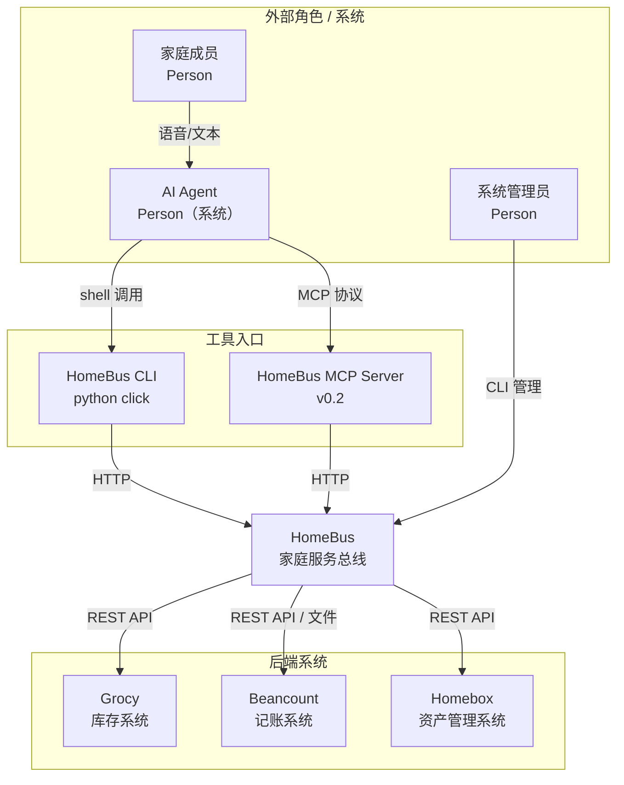

# C4 Level 1: System Context

> 定义 HomeBus 系统的边界——它跟谁交互、交互什么、不做什么。

## 系统边界

## 外部角色

| 角色 | 类型 | 描述 | 与 HomeBus 的交互 |
|------|------|------|-------------------|
| **家庭成员** | Person (人) | 家庭中的普通用户，通过语音/文本/快捷指令触发操作 | 间接（通过 Agent）——用户对 Agent 说话，Agent 调用 HomeBus |
| **AI Agent** | Person (系统) | 意图识别引擎（Hermes/其他 LLM），负责解析自然语言→结构化事件 | **主要调用者**。通过 CLI/MCP 调用 HomeBus，发送事件、发起查询、查询观测面 |
| **系统管理员** | Person (人) | 运维人员，管理配置、查看调谐报告、处理异常报警 | 直接操作 HomeBus（CLI 管理模式），或通过调谐引擎输出日志 |

## 外部系统

| 系统 | 类型 | 描述 | 与 HomeBus 的关系 |
|------|------|------|------------------|
| **Grocy** | Software System | 消耗品（食品、日化）库存管理系统 | HomeBus → Grocy：写入库存变更；HomeBus → Grocy：读取库存状态（查询/观测面） |
| **Beancount** | Software System | 复式记账系统，管理家庭财务流水 | HomeBus → Beancount：写入记账分录；HomeBus → Beancount：读取账目余额（查询/观测面） |
| **Homebox** | Software System | 耐用品（工具、电器、收藏品）资产管理系统 | HomeBus → Homebox：写入资产变更；HomeBus → Homebox：读取资产列表（查询/观测面） |
| **HomeBus CLI** | Software System | 命令行工具封装，Agent 通过 CLI 调用 HomeBus | Agent → CLI → HomeBus API |
| **HomeBus MCP Server** | Software System | MCP 协议封装，支持 MCP Client 直接调用 | Agent/MCP Client → MCP Server → HomeBus API |

## 系统关系总表

| 源 | 目标 | 关系 | 协议 | 说明 |
|----|------|------|------|------|
| AI Agent | HomeBus | 调用 | CLI / MCP / HTTP | Agent 通过 CLI 或 MCP Server 向 HomeBus 发送事件和查询（含观测面查询） |
| HomeBus | Grocy | 调用 | REST API | 写入库存变更，查询库存状态，观测面聚合查库存 |
| HomeBus | Beancount | 调用 | 共享库 import (beancount_writer.py) + Fava REST API (v0.2 读) | 写入：Task Executor import beancount_writer；读取：Fava API 查余额/账目 |
| HomeBus | Homebox | 调用 | REST API | 写入资产变更，查询资产状态，观测面聚合查资产 |
| HomeBus CLI | HomeBus API | 调用 | HTTP (JSON) | 内部调用，Agent 不直接感知 |
| HomeBus MCP Server | HomeBus API | 调用 | HTTP (JSON) | MCP 处理层调 HomeBus 内部 API |
| 家庭成员 | AI Agent | 输入 | 语音/文本 | 家庭成员的交互入口，HomeBus 不直接面向用户 |

## 明确的非边界

HomeBus 不做的事：

- ❌ 不直接接收用户自然语言输入（由 Agent 负责）
- ❌ 不维护会话状态（Agent 维护 memory）
- ❌ 不进行物品分类推断（Agent 负责分类）
- ❌ 不进行资产位置智能归类（Agent 通过 query 获取位置列表后推断；用户默认确认，纠偏时 Agent 重新查询更新）
- ❌ 不存储家庭人员信息/权限（未来可扩展）
- ❌ 不做实时 Webhook 监听后端变更（由调谐引擎定期比对）
- ❌ 不替代后端系统（Grocy/Beancount/Homebox 仍是各自领域的权威数据源）
